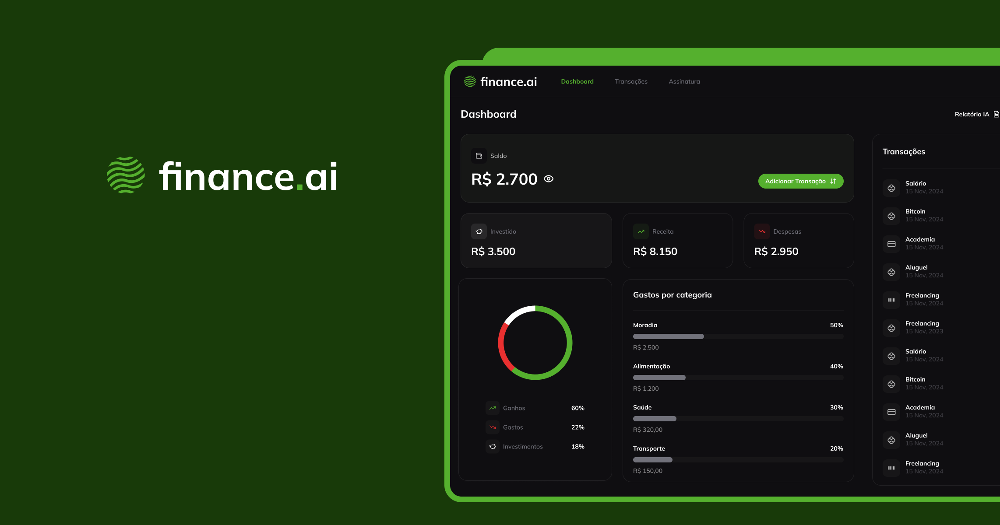

<h1 align="center">
  
  
</h1>

    
  <a href="#tecnologias"> Tecnologias </a> &nbsp; &nbsp; &nbsp; | &nbsp; &nbsp; &nbsp;        
  <a href="#como-executar"> Como executar </a> &nbsp; &nbsp; &nbsp; | &nbsp; &nbsp; &nbsp;          
  <a href="#projeto"> Projeto </a> &nbsp; &nbsp; &nbsp; | &nbsp; &nbsp; &nbsp;  

  

## 🧪 Tecnologias

Esse projeto foi desenvolvido com as seguintes tecnologias:

  

    <a href='https://nextjs.org/'>NextJs</a>
  

  
  

    <a href='https://reactjs.org'>React</a>
  

  

    <a href='https://www.typescriptlang.org/'>Typescript</a>
  

  

    <a href='https://tailwindcss.com/'>Tailwind</a>
  

  

    <a href='https://ui.shadcn.com/'>Shadcn UI</a>
  

  

    <a href='https://react-hook-form.com/'>React Hook Form</a>
  

  

    <a href='https://zod.dev/'>Zod</a>
  

## 🚀 Como executar

Acesse o link -> https://finance-ai-livid.vercel.app/

## 💻 Projeto

Finance AI é uma versão simplificada de um sistema de gerenciamento de finanças.

Nele é possível registrar transações de investimento, depósito ou despesa, assim como acompanhar o balanço do mês através de graficos e gerar um relatório com IA para identificar gastos desnecessários e otimizar a gestão financeira.
